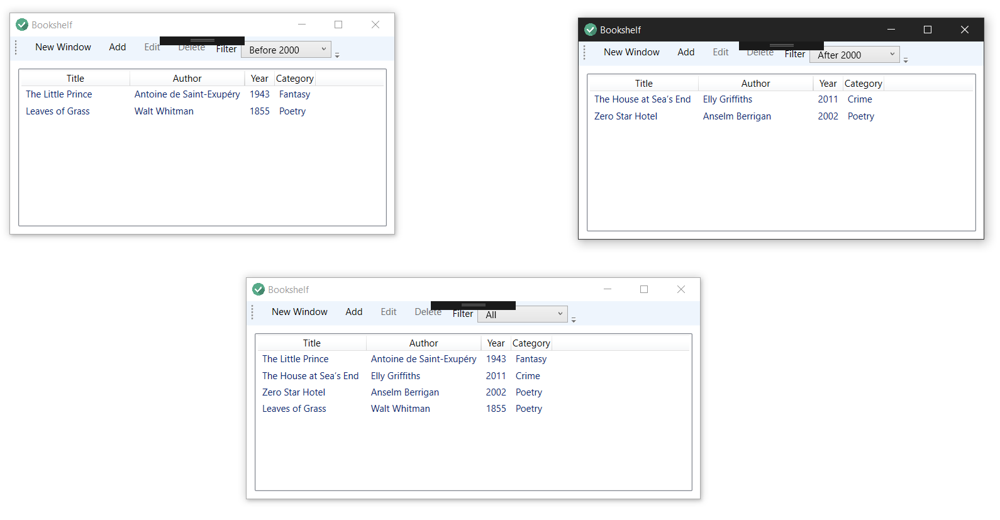
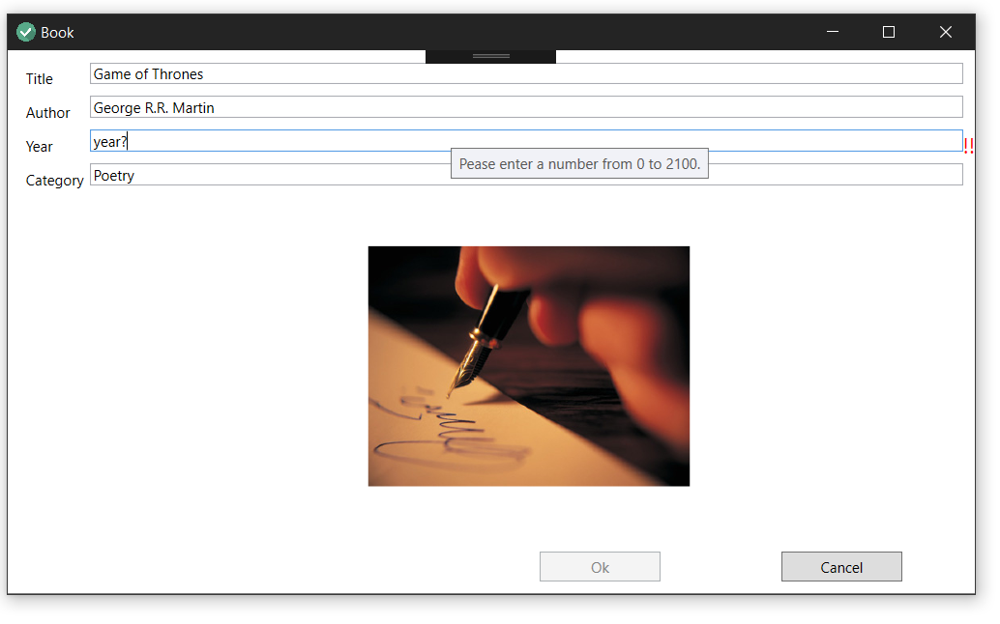
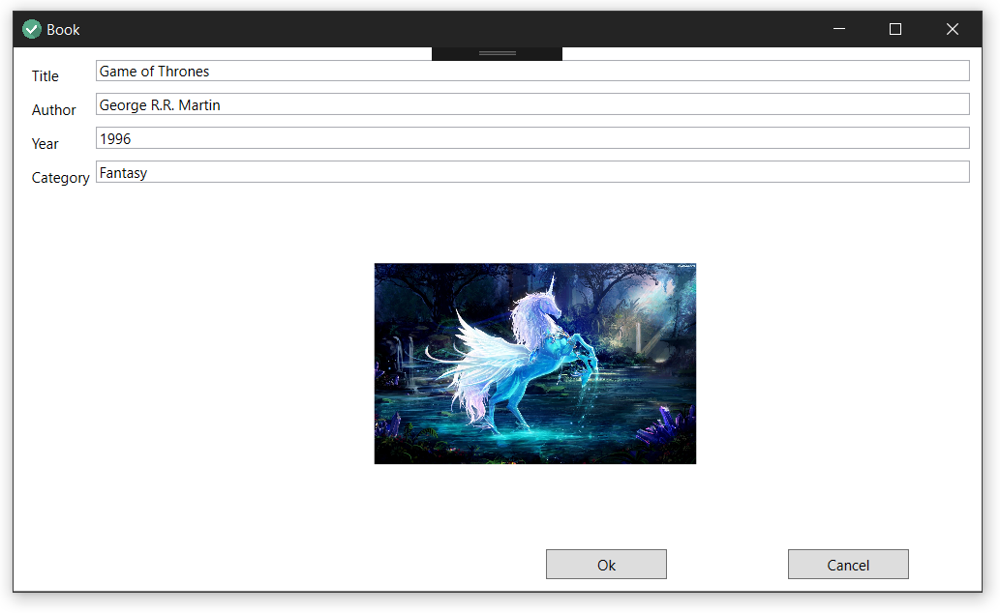
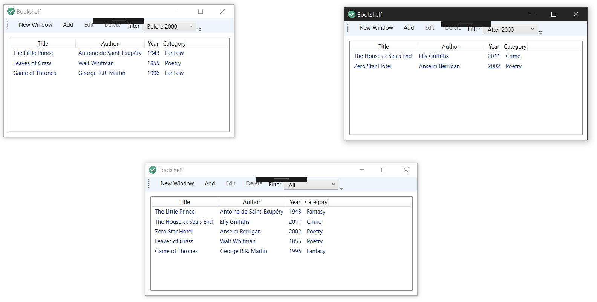

# Bookshelf
This program is an organiser for your book collection.

### Technologies
This project is a WPF prorogram written on C# and XAML. It uses the View-Model-ViewModel strategy.

### Interface

